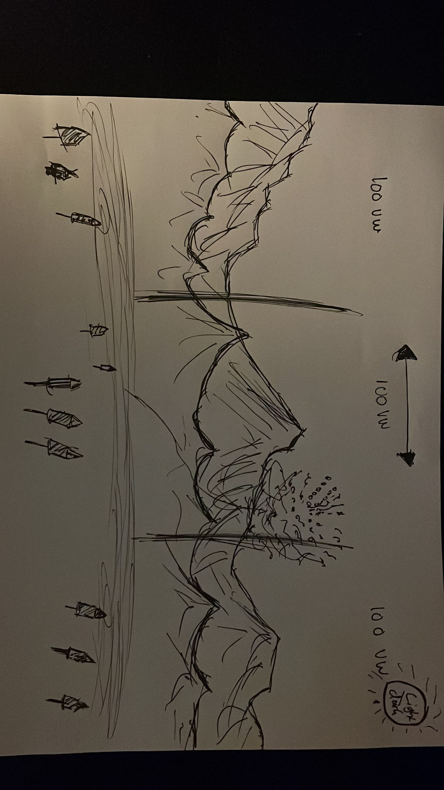

# Vuurwerkshow in berglandschap
https://davi9898.github.io/css-to-the-rescue-2223/vuurwerkshow
# Week 1


### Inleiding

Voor het vak CSS to the rescue ga ik een vuurwerkshow maken. De bedoeling is dat deze interactief is en door middel van klikken afgevuurd kan worden. Het vuurwerk moet op de voorgrond gebeuren. Het werk zal in 2D gemaakt worden. Op de achtergrond zal een berg landschap te zien. Om het gebied groter te maken dan één scherm, ga ik proberen om een optie toe te voegen waardoor je een viewport width naar links en rechts kan. Dit zou bijvoorbeeld door een button gebeuren of door te scrollen met je muis.

### Onderzoek 

Ik ben er snel achter gekomen deze week dat ik niet kan gaan scrollen om de pagina naar links en naar rechts te laten bewegen. Hiervoor ga ik radio buttons gebruiken en de :has() selector toepassen. De bergen ga ik maken doormiddel van driehoekjes en met schaduwen. 

functionaliteiten:
- Scherm van het midden naar links en rechts kunnen bewegen.
- Bergen 
- Light/Dark mode door middel van op de zon te klikken
- Berg laten wegvliegen door erop te klikken (easter egg)
- Vuurpijlen / Vuurdozen
- Nice colors.
- Responsive ( media queries om bergen te verwijderen wanneer scherm kleiner wordt) 

### Schetsen



Je ziet hier hoe de drie verschillende views ontworpen moeten worden. Ook zie je de klikbare pijlen die voor interactie zorgen.

## Week 2

Deze week heb ik de lessen gemist omdat ik ziek was. Ondertussen ben ik thuis wel verder gaan werken aan mijn berglandschap

### Dag 1
Op dag één ben ik bezig gegaan om de schermen 100vw naar links en naar rechts te laten bewegen. Dit heb ik gedaan door een translateX(-200vw -> 100vw) toe te passen. Dit heeft me wel even geduurd voordat me dit lukte, ik liep de heletijd tegen problemen aan. Ook wilde ik graag dat de gebruiker landde op de home page. Hieronder kun je zien hoe ik dit heb aangepakt:
```
body:has(input[value="home"]:checked) main {
    transform: translateX(-100vw);
}

body:has(input[value="links"]:checked) main {
    transform: translateX(0);
}

body:has(input[value="rechts"]:checked) main {
    transform: translateX(-200vw);
}
```
Hier zie je de labels en de radio buttons hoe die zijn gestructureerd:
```
    <li>
                    <label for="links">
                        <span>Links</span>
                        <input type="radio" id="links" name="nav" value="links" />
                    </label>
                </li>

                <li>
                    <label for="home">
                        <span>Home</span>
                        <input type="radio" id="home" name="nav" value="home" checked />
                    </label>
                </li>

                <li>
                    <label for="rechts">
                        <input type="radio" id="rechts" name="nav" value="rechts" />
                    </label>
```

### Dag 2
Op dag 2 ben ik mij gaan richten op het volledig focusen van het maken van het berglandschap. Ik heb eerst gekeken hoe ik de bergen kon gaan maken. Ik had eerder wel eens driehoekbergen gemaakt en piramides bij een cursus van Sanne. Dit kon ik mooi gebruiken. Natuurlijk heb ik ook inspiratie gebruikt van het internet.

### Bergjes

De bergen heb ik gemaakt door gebruik te maken van de volgende code:
```
section:nth-of-type(1) > div:first-of-type { /* container, hiermee kan ik de berg gemakkelijk bewegen */ 
    position: absolute;
    bottom: 30vh;
    left: -3vw;
}

section:nth-of-type(1) > div:first-of-type > div:first-of-type { /* De berg zelf kan ik hier groter en kleiner maken. */
    position: absolute;
    content: '';
    bottom: 0;
    left: 0px;
    border-top: 0px solid transparent;
    border-right: 130px solid transparent; 
    border-bottom: 150px solid #68F193; 
    border-left: 130px solid transparent; 
    z-index: 5;
  }

section:nth-of-type(1) > div:first-of-type > div:nth-of-type(2) { /* De schaduw van de berg kan ik hier aanpassen */
    position: absolute;
    content: '';
    bottom: 0;
    left: 130px;
    border-top: 0px solid transparent;
    border-right: 100px solid transparent; 
    border-bottom: 150px solid #40945C; 
    border-left: 0px solid transparent; 
    z-index: 5;
    transform-origin: top right;
    transform: skewX(18deg);
}
```

### Feedback
Sanne heeft aangegeven dat ik custom properties kan toepassen, dat dit mij zal helpen. 

## Week 3

### Dag 1
Op dag 1 van Week 3 heeft Sanne s'ochtends een gastcollege gegeven. Deze heb ik helaas niet kunnen bijwonen omdat ik een afspraak had in de ochtend. Vervolgens ben ik verder gegaan met het plaatsen van de verchillende bergen in het landschap. Ik ben vervolgens een cursus gaan volgen over het gebruik van SVG paden. We hebben het voornamelijk gehad over de offset-path: path; functie die CSS heeft te bieden. Hoe je een SVG path kan maken in bijvoorbeeld Figma en vervolgens kan exporteren. Deze open je dan als een txt bestand en hier kan je het SVG path uithalen. Wat ik ook erg interessant vond is het toevoegen van een delay aan een transition. Dit heb ik zelf nog nooit gebruik en was mij er ook niet van bewust dat dit mogelijk was. 

Vervolgens ben ik voor elke berg de kleur gaan veranderen voor een variabel en deze in de :root gestopt. Hierdoor kan ik de kleuren van de bergen en de grond veranderen wanneer ik zou willen. Ook biedt dit een functionaliteit voor als ik bijvoorbeeld een dark mode wil toevoegen. Ik had dit beter eerder kunnen implementeren, dit heeft erg veel tijd gekost.

functionaliteiten die ik nog wil toevoegen:
- Light/Dark mode door middel van op de zon te klikken
- Berg laten wegvliegen door erop te klikken (easter egg)
- Vuurpijlen / Vuurdozen die exploderen.
- Responsive ( media queries om bergen te verwijderen wanneer scherm kleiner wordt)

### Dag 2
Op dag 2 zijn we begonnen met een gastcollege van Manuel Matuzovic. Manuel is schrijver van het blog 100days of More or less modern CSS, hij heeft ons allerlei epische properties laten zien die CSS met zich mee draagt. Vervolgens ben ik met Sanne gaan zitten om te kijken naar custom properties. Ik kreeg een privé sessie omdat niemand anders zich hiervoor had aangemeld. Hierin gingen we mijn huidge bergen transformeren met een border-width zodat we custom properties makkelijk konden gebruiken. Hier stak ik veel van op en kreeg ik door hoe ik deze functionaliteit kan toepassen. 

Vervolgens lukte het me niet om het ijstopje op de berg te plaatsen op de manier waarop we nu de bergen hadden ge hercreëerd. Sanne vond de manier waarop het ging sowieso al lelijk volgensmij dus had hij het geniale idee om nogmaals de bergen te transformeren naar een nieuw landschap. Dit keer met bergen met wel een sneeuwstukje er boven op. Hieronder valt te zien hoe we dit gedaan hebben.
```

/*************/
/* SETTINGS  */
/*************/
section:nth-of-type(1) ul {
	display:flex;
	align-items:end;
	justify-content:center;
	margin:0;
	padding:0;
	list-style:none;


	background-color:transparent;
}

section:nth-of-type(1) li {
	position:absolute;
	bottom:15vw; 
	width:var(--width, 10em);
	height:var(--height, 10em);
	
	left:var(--left, 0);
	z-index:var(--z-index, 0);
}

section:nth-of-type(1) li > div {
	position:absolute;
	inset:0;
}

section:nth-of-type(1) li > div:nth-of-type(1) {
	background-color:var(--clr-sun, lightgreen);

	clip-path: polygon(
		var(--point, 50%) 0%, 
		var(--shade, 50%) 100%, 
		0% 100%, 
		var(--point, 50%) 0%
	);

}

section:nth-of-type(1) li > div:nth-of-type(2) {
	background-color:var(--clr-shade, green);
	
	clip-path: polygon(
		var(--point, 50%) 0%, 
		var(--shade, 50%) 100%, 
		100% 100%, 
		var(--point, 50%) 0%
	);

}

/* snow */
section:nth-of-type(1) div div {
	position:absolute;
	width:100%;
	height:var(--snow, 40%);
}

section:nth-of-type(1) div div {
	clip-path: polygon(36% 100%, 26% 70%, 10% 100%, 0 67%, 0% 0%, 100% 0%, 100% 66%, 86% 89%, 79% 56%, 68% 100%, 59% 72%, 45% 68%);

}

section:nth-of-type(1) div:nth-of-type(1) div {
	background-color:var(--snw-sun, #fff);
}


section:nth-of-type(1) div:nth-of-type(2) div {
	background-color:var(--snw-shade, #ccd);
}


/*************/
/* DE BERGEN */
/*************/

section:nth-of-type(1) li:nth-of-type(1) {
	--height:20em;
	--width:28em;
	
	--shade:70%;
	--point:30%;
	
	--snow: 40%;
	
	--clr-sun:moccasin;
	--clr-shade:saddlebrown;
	
	--snw-sun: #ff9;
	--snw-shade: #cc6;

    --left: 20vw;
}
```
Hieronder kun je bij het list item de berg net zo maken zoals je zelf wilt door de custom property aan te passen. Wat de code robuuster maken en er voor zorgt dat er minder lines of code worden gebruikt. Dit heeft me enorm geholpen om de kwaliteit van zowel m'n code als m'n bergen vooruit te brengen. Ik moet nog wel veel doen zoals echt vuurwerk maken.

functionaliteiten die ik nog wil toevoegen:
- Berg laten wegvliegen door erop te klikken (easter egg)
- Vuurpijlen / Vuurdozen die wegvliegen (voetzoekers)
- Responsive ( media queries om bergen te verwijderen wanneer scherm kleiner wordt)

## Week 3,5
### Dag 1
Deze dag ben ik de hele dag bezig geweest om de berglandschappen juist te krijgen, ik wilde voorheen drie verschillende berglandschappen maken. Dit zijn nu drie landschappen geworden met ongeveer dezelfde bergen. Alleen in dachlicht, zonsondergang en nacht. Ook heb ik verschillende veranderingen gemaakt. Met de huidige manier van bergen maken had ik toch wat complicaties met het responsive houden van de berg. Ik heb nu de height veranderd door een aspect ratio, ook schaalt de width ten opzichte van de parent nu in percentage. Hierdoor schalen de bergen mooi. Eigenlijk vind ik ze nu weer te klein wanneer je op een klein scherm zit. Hier kan ik misschien nog een draai aan geven.

functionaliteiten die ik nog wil toevoegen:
- Berg laten wegvliegen door erop te klikken (easter egg)
- Vuurpijlen / Vuurdozen die wegvliegen (voetzoekers)
- Responsive ( media queries om bergen te verwijderen wanneer scherm kleiner wordt)

### Dag 2
Deze dag ben ik bezig geweest het maken van media queries voor de bergen. Ik laat nu doormiddel van media queries bergen verdwijnen. Eigenlijk loopt het allemaal nog niet helemaal lekker maar door tijdgebrek ben ik genoodzaakt om verder te gaan.

```
@media only screen and (max-width: 800px) {
  section:nth-of-type(1) li:nth-of-type(1),
  section:nth-of-type(1) li:nth-of-type(3),
  section:nth-of-type(1) li:nth-of-type(8),
  section:nth-of-type(1) li:nth-of-type(11) {
    display: none;
  }
```
